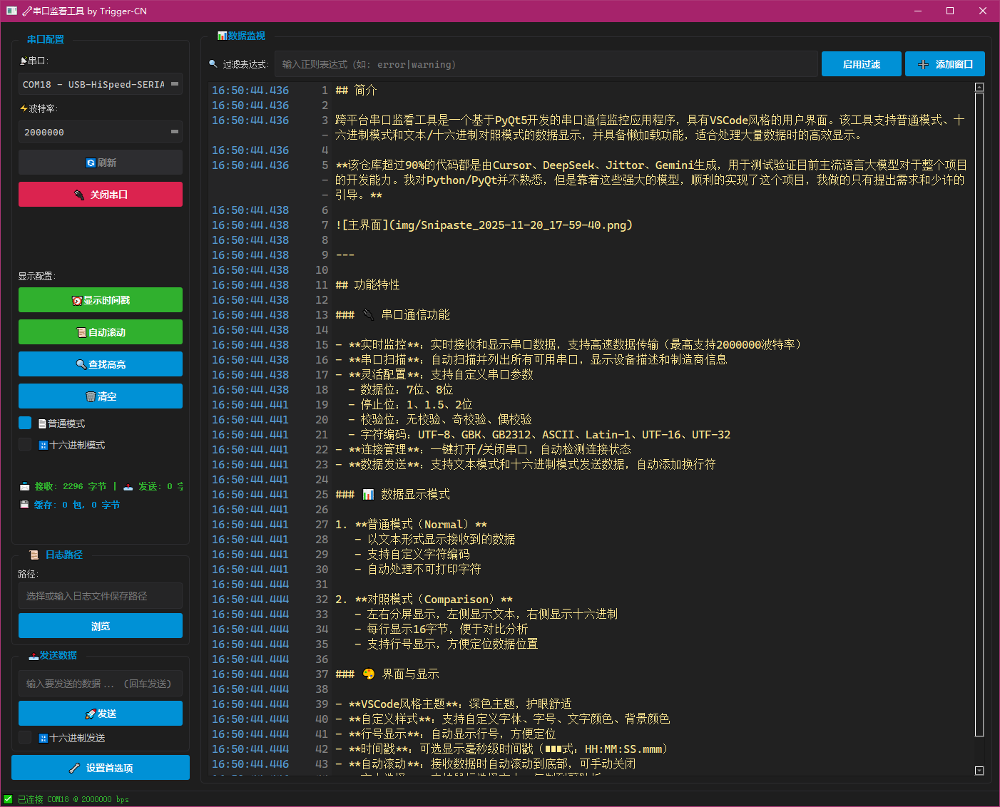

# 串口监看工具


## 简介

跨平台串口监看工具是一个基于PyQt5开发的串口通信监控应用程序，具有VSCode风格的用户界面。该工具支持普通模式、十六进制模式和文本/十六进制对照模式的数据显示，并具备懒加载功能，适合处理大量数据时的高效显示。

**该仓库超过90%的代码都是由Cursor、DeepSeek、Jittor、Gemini生成，用于测试验证目前主流语言大模型对于整个项目的开发能力。我对Python/PyQt并不熟悉，但是靠着这些强大的模型，顺利的实现了这个项目，我做的只有提出需求和少许的引导。**



---

## 功能特性

### 🔌 串口通信功能

- **实时监控**：实时接收和显示串口数据，支持高速数据传输（最高支持2000000波特率）
- **串口扫描**：自动扫描并列出所有可用串口，显示设备描述和制造商信息
- **灵活配置**：支持自定义串口参数
  - 数据位：7位、8位
  - 停止位：1、1.5、2位
  - 校验位：无校验、奇校验、偶校验
  - 字符编码：UTF-8、GBK、GB2312、ASCII、Latin-1、UTF-16、UTF-32
- **连接管理**：一键打开/关闭串口，自动检测连接状态
- **数据发送**：支持文本模式和十六进制模式发送数据，自动添加换行符

### 📊 数据显示模式

1. **普通模式（Normal）**
   - 以文本形式显示接收到的数据
   - 支持自定义字符编码
   - 自动处理不可打印字符

2. **对照模式（Comparison）**
   - 左右分屏显示，左侧显示文本，右侧显示十六进制
   - 每行显示16字节，便于对比分析
   - 支持行号显示，方便定位数据位置

### 🎨 界面与显示

- **VSCode风格主题**：深色主题，护眼舒适
- **自定义样式**：支持自定义字体、字号、文字颜色、背景颜色
- **行号显示**：自动显示行号，方便定位
- **时间戳**：可选显示毫秒级时间戳（格式：HH:MM:SS.mmm）
- **自动滚动**：接收数据时自动滚动到底部，可手动关闭
- **文本选择**：支持鼠标选择文本，复制到剪贴板
- **多窗口支持**：可打开多个日志窗口，独立查看不同数据

### 🔍 高级功能

- **关键字高亮**：支持配置最多10条高亮规则
  - 支持普通关键字匹配和正则表达式匹配
  - 自定义高亮颜色
  - 实时高亮显示匹配内容
- **数据过滤**：支持正则表达式过滤，只显示匹配的数据行
- **数据统计**：实时显示接收和发送的数据包数量
- **日志保存**：自动保存接收数据为日志文件
  - 支持自定义保存路径
  - 保存完整原始数据（不受显示行数限制）
  - 断开连接时自动保存
- **自动更新检查**：支持从GitHub Releases检查新版本
  - 在首选项窗口中点击"检查更新"按钮
  - 自动获取最新版本信息和更新说明
  - 一键跳转到下载页面

### ⚡ 性能优化

- **批量UI更新**：避免频繁刷新界面，使用定时器批量更新
- **多级缓存策略**：
  - 换行结果缓存：缓存文本换行计算结果
  - 高亮匹配缓存：缓存关键字匹配结果
  - 过滤结果缓存：缓存过滤匹配结果
  - 总显示行数缓存：缓存总行数计算结果
- **行数限制**：默认最多显示50000行，超出自动删除最旧数据
- **内存优化**：原始数据与显示数据分离存储，原始数据用于日志保存

---

## 性能优化详解

### 缓存策略

1. **数据缓存管理器（DataCacheManager）**
   - 最大缓存限制：默认500KB，可配置
   - 自动清理：超过限制时自动删除最旧数据
   - 暂停/恢复：支持暂停缓存更新，用于批量操作

2. **显示缓存**
   - 换行缓存：避免重复计算文本换行
   - 高亮缓存：缓存关键字匹配位置和颜色
   - 过滤缓存：缓存每行的过滤结果

3. **批量更新**
   - 使用QTimer延迟更新，避免频繁刷新
   - 合并多次更新请求，减少重绘次数

### 内存管理

- **分离存储**：显示数据（受行数限制）和原始数据（完整保存）分开存储
- **智能清理**：超过限制10%时才触发清理，避免频繁操作
- **行号偏移**：使用行号偏移量，避免重新索引所有数据

---

## 安装与运行

### 系统要求

- **操作系统**：Windows、Linux、macOS（跨平台支持）
- **Python版本**：Python 3.6+（推荐Python 3.8+）
- **依赖库**：
  - PyQt5 >= 5.12
  - pyserial >= 3.4

### 安装步骤

1. **克隆仓库**
```bash
git clone https://github.com/Trigger-CN/SerialPortMonitor.git
cd SerialPortMonitor
```

2. **安装依赖**
```bash
pip install PyQt5 pyserial
```

3. **运行程序**
```bash
python main.py
```

### 打包为可执行文件（可选）

使用PyInstaller打包：

```bash
pip install pyinstaller
pyinstaller main.spec
```

打包后的可执行文件位于 `dist/` 目录。

---

## 详细操作指引

### 1. 串口连接

#### 步骤一：选择串口
1. 点击左侧"串口"下拉框
2. 选择要连接的串口（显示格式：`COMx - 设备描述`）
3. 点击"刷新串口"按钮可更新可用串口列表

#### 步骤二：配置参数
1. **波特率**：从下拉框选择或输入自定义波特率（支持常用波特率：9600、115200、2000000等）
2. **数据位**：在"设置首选项"中配置（默认8位）
3. **停止位**：在"设置首选项"中配置（默认1位）
4. **校验位**：在"设置首选项"中配置（默认无校验）
5. **字符编码**：在"设置首选项"中配置（默认UTF-8）

#### 步骤三：打开串口
1. 点击"打开串口"按钮
2. 连接成功后，按钮变为"关闭串口"，状态栏显示连接信息
3. 开始接收数据时，右侧显示区域会实时更新

### 2. 数据接收与查看

#### 切换显示模式
- **普通模式**：文本显示
- **十六进制模式**：十六进制显示

#### 时间戳显示
- 勾选"时间戳"复选框，每行数据前会显示接收时间（格式：`[HH:MM:SS.mmm]`）

#### 自动滚动
- 勾选"自动滚动"复选框，新数据到达时自动滚动到底部
- 取消勾选可手动控制滚动位置

#### 清空显示
- 点击"清空"按钮，清除当前显示的数据（不影响原始数据缓存）

### 3. 数据发送

#### 文本模式发送
1. 在"发送数据"文本框中输入要发送的文本
2. 确保"发送模式"选择为"文本"
3. 点击"发送"按钮
4. 数据会自动添加 `\r\n` 换行符后发送

#### 十六进制模式发送
1. 在"发送数据"文本框中输入十六进制数据（例如：`48 65 6C 6C 6F` 或 `48656C6C6F`）
2. 将"发送模式"切换为"十六进制"
3. 点击"发送"按钮
4. 程序会自动解析十六进制字符串并发送

**注意**：十六进制字符串支持空格、逗号、冒号等分隔符，程序会自动处理。

### 4. 高亮规则配置

#### 添加高亮规则
1. 点击"高亮配置"按钮，打开高亮配置窗口
2. 在关键字输入框中输入要匹配的关键字
3. 如需使用正则表达式，勾选"Regex"复选框
4. 点击颜色按钮选择高亮颜色
5. 点击"Apply"应用规则

#### 高亮规则示例
- **普通匹配**：输入 `ERROR`，所有包含"ERROR"的行会被高亮
- **正则表达式**：勾选Regex，输入 `\d{4}-\d{2}-\d{2}`，匹配日期格式

#### 删除规则
- 点击规则右侧的"Delete"按钮删除该规则
- 最多支持10条高亮规则

### 5. 数据过滤

#### 启用过滤
1. 在过滤输入框中输入正则表达式
2. 程序会自动应用过滤，只显示匹配的行
3. 清空输入框可取消过滤

#### 过滤示例
- `ERROR|WARN`：只显示包含"ERROR"或"WARN"的行
- `^\d+`：只显示以数字开头的行

### 6. 首选项设置

点击"设置首选项"按钮打开设置窗口：

#### 串口设置
- **数据位**：7位或8位
- **停止位**：1、1.5或2位
- **校验位**：无、奇校验、偶校验
- **字符编码**：选择数据解码使用的编码

#### 日志显示设置
- **字体**：选择显示字体（推荐等宽字体，如Cascadia Code、Consolas）
- **字号**：6-72号字体
- **文字颜色**：点击"Text Color"按钮选择
- **背景颜色**：点击"BG Color"按钮选择
- **总缓存行数**：设置最大显示行数（1000-1000000行，默认50000行）

#### 应用信息
- 显示作者、版本号、邮箱、GitHub链接等信息
- **检查更新**：点击"🔄 检查更新"按钮可检查是否有新版本可用
  - 如果有新版本，会显示更新对话框，包含版本信息和更新说明
  - 点击"前往下载"按钮可在浏览器中打开下载页面
  - 如果没有新版本，会提示"您已使用最新版本"

### 7. 日志保存

#### 设置保存路径
1. 点击"选择日志路径"按钮
2. 选择保存目录
3. 路径会显示在按钮下方

#### 自动保存
- 断开串口连接时，程序会自动将接收到的所有原始数据保存为日志文件
- 保存的文件名格式：`serial_log_YYYYMMDD_HHMMSS.bin`

#### 手动保存
- 可在代码中扩展手动保存功能

### 8. 多窗口日志查看

- 可以打开多个独立的日志窗口
- 每个窗口可以独立配置显示模式和过滤规则
- 方便同时查看不同时间段或不同过滤条件的数据

---

## 配置文件说明

程序会自动创建和加载 `config.json` 配置文件，存储以下设置：

```json
{
    "port": "COM18 - USB-HiSpeed-SERIAL-B CH347 (COM18) (wch.cn)",
    "baudrate": 2000000,
    "display_mode": "normal",
    "timestamp": true,
    "auto_scroll": true,
    "log_path": "",
    "data_bits": 8,
    "stop_bits": "1",
    "parity": "无",
    "encoding": "UTF-8",
    "font": "Cascadia Code",
    "font_size": 12,
    "font_color": "#ffe790",
    "bg_color": "#212121",
    "max_lines": 50000,
    "highlight_rules": [
        {
            "keyword": "gui_win_enter",
            "use_regex": false,
            "color": "#19277f"
        }
    ]
}
```

### 配置项说明

| 配置项 | 类型 | 说明 |
|--------|------|------|
| `port` | string | 上次选择的串口 |
| `baudrate` | number | 波特率 |
| `display_mode` | string | 显示模式：normal/hex/comparison |
| `timestamp` | boolean | 是否显示时间戳 |
| `auto_scroll` | boolean | 是否自动滚动 |
| `log_path` | string | 日志保存路径 |
| `data_bits` | number | 数据位：7或8 |
| `stop_bits` | string | 停止位："1"/"1.5"/"2" |
| `parity` | string | 校验位："无"/"奇"/"偶" |
| `encoding` | string | 字符编码 |
| `font` | string | 字体名称 |
| `font_size` | number | 字号 |
| `font_color` | string | 文字颜色（十六进制） |
| `bg_color` | string | 背景颜色（十六进制） |
| `max_lines` | number | 最大显示行数 |
| `highlight_rules` | array | 高亮规则列表 |

---

## 项目结构

```
serialdial/
├── main.py                 # 程序入口
├── config.json            # 配置文件（自动生成）
├── version.py             # 版本信息
├── readme.md             # 说明文档
├── LICENSE               # 许可证
├── main.spec             # PyInstaller打包配置
│
├── core/                 # 核心功能模块
│   ├── serial_manager.py    # 串口管理器
│   └── port_scanner.py      # 串口扫描器
│
├── ui/                   # 用户界面模块
│   ├── main_window.py       # 主窗口
│   ├── preference_window.py # 首选项窗口
│   ├── highlight_config_window.py # 高亮配置窗口
│   ├── log_window.py        # 日志窗口
│   ├── update_dialog.py     # 更新对话框
│   ├── long_text_widget.py  # 长文本显示组件（懒加载）
│   ├── lazy_text_edit.py    # 懒加载文本编辑器
│   └── widgets.py           # 自定义UI组件
│
├── utils/                # 工具类模块
│   ├── config_handler.py   # 配置处理器
│   ├── data_cache.py       # 数据缓存管理器
│   ├── data_processor.py   # 数据处理器
│   ├── file_handler.py     # 文件处理器
│   └── update_checker.py   # 更新检查器
│
├── styles/               # 样式模块
│   └── vs_code_theme.py   # VSCode风格主题
│
├── img/                  # 图片资源
├── log/                  # 日志文件目录
└── dist/                 # 打包输出目录
```

### 核心模块说明

- **serial_manager.py**：负责串口的打开、关闭、数据读写
- **data_cache.py**：管理接收数据的缓存，控制内存使用
- **data_processor.py**：处理数据的格式转换（文本/十六进制/对照模式）
- **long_text_widget.py**：高性能长文本显示组件，实现懒加载和缓存优化
- **config_handler.py**：配置文件的读写管理

---

## 常见问题

### Q1: 串口打开失败怎么办？
- 检查串口是否被其他程序占用
- 确认串口参数（波特率、数据位等）是否正确
- 检查串口驱动是否正常安装
- 尝试以管理员权限运行程序

### Q2: 数据显示乱码？
- 检查"设置首选项"中的字符编码设置
- 尝试切换不同的编码（UTF-8、GBK等）
- 确认发送端使用的编码格式

### Q3: 程序运行卡顿？
- 检查数据量是否过大，可降低"总缓存行数"设置
- 关闭不必要的高亮规则
- 关闭过滤功能
- 尝试切换到普通模式（对照模式性能开销较大）

### Q4: 如何保存特定时间段的数据？
- 使用过滤功能筛选需要的数据
- 打开新的日志窗口查看过滤后的数据
- 手动复制需要的数据

### Q5: 支持哪些操作系统？
- Windows 7/8/10/11
- Linux（需要安装PyQt5）
- macOS（需要安装PyQt5）

### Q6: 如何检查更新？
- 打开"设置首选项"窗口
- 在"应用信息"部分点击"🔄 检查更新"按钮
- 程序会自动从GitHub Releases获取最新版本信息
- 如果有新版本，会显示更新对话框，可以点击"前往下载"按钮下载新版本

---

## 技术栈

- **GUI框架**：PyQt5
- **串口通信**：pyserial
- **数据处理**：Python标准库
- **打包工具**：PyInstaller（可选）

---

## 贡献

欢迎任何形式的贡献！

### 贡献方式
- 🐛 报告Bug
- 💡 提出功能建议
- 📝 改进文档
- 🔧 提交代码修复
- ⭐ 给项目点星

---

## 许可证

本项目采用MIT许可证，具体请参考 [LICENSE](LICENSE) 文件。

---

## 联系方式

- **作者**：Trigger-CN
- **邮箱**：cometjab@gmail.com
- **GitHub**：https://github.com/Trigger-CN/SerialPortMonitor

---

## 致谢

感谢以下AI模型在项目开发中的帮助：
- Cursor
- DeepSeek
- Jittor
- Gemini

---

**⭐ 如果这个项目对你有帮助，请给个Star支持一下！**
