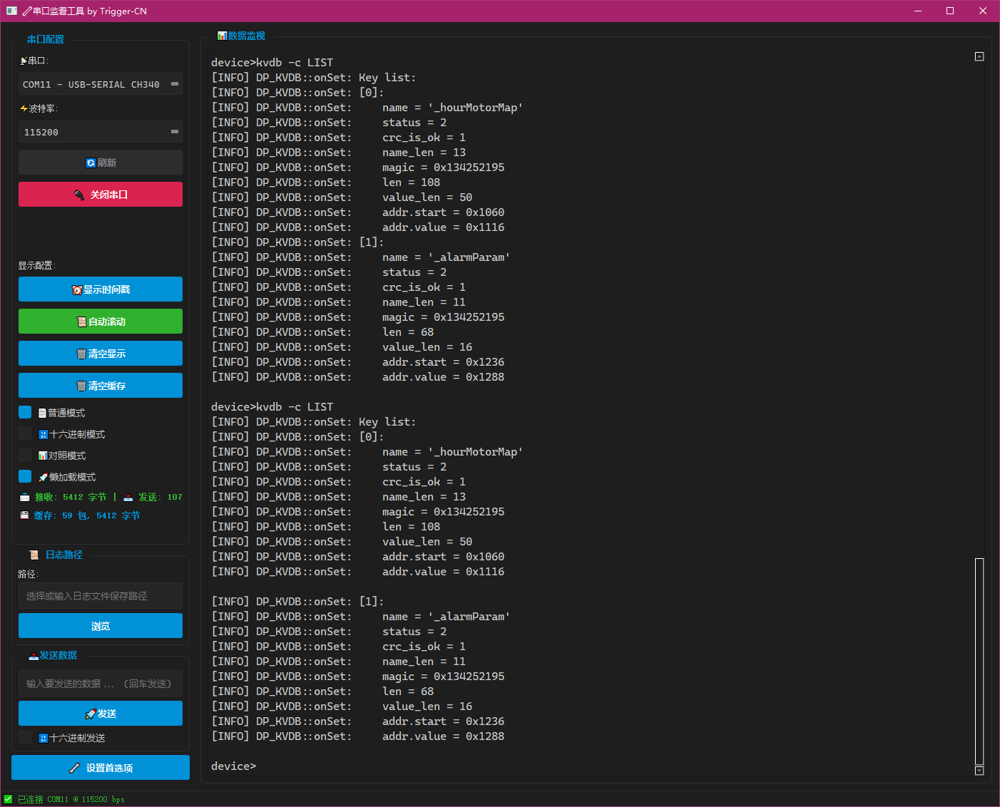

# 串口监看工具

## 简介
跨平台串口监看工具是一个基于PyQt5开发的串口通信监控应用程序，具有VSCode风格的用户界面。该工具支持普通模式、十六进制模式和文本/十六进制对照模式的数据显示，并具备懒加载功能，适合处理大量数据时的高效显示。

**该仓库超过90%的代码都是由DeepSeek、Jittor、Gemini生成，用于测试验证目前主流语言大模型对于整个项目的开发能力。我对Ppython/yQt并不熟悉，但是靠着这些强大的模型，顺利的实现了这个项目，我做的只有提出需求和少许的引导。**





## 主要功能
- **串口监控**：实时监控串口通信的数据接收与发送。
- **显示模式**：支持三种显示模式供用户选择，普通模式、十六进制模式和对照模式。
- **懒加载**：在处理大量数据时，采用懒加载策略，优化显示性能。
- **数据发送**：用户可以通过界面输入数据，选择模式并发送。
- **日志保存**：支持将接收数据保存为日志文件，并可自定义日志保存路径。
- **自动滚动**：数据接收时自动滚动到显示区域底部。
- **错误处理**：具备错误捕获与处理机制，确保应用程序的稳定性。

## 安装与运行
### 依赖
- Python 3.6+ （推荐Python 3.8+）
- PyQt5
- pyserial

### 安装依赖
你可以使用pip来安装所有必要的Python包：
```bash
pip install PyQt5 pyserial
```

### 运行程序
在项目的根目录下运行以下命令来启动应用程序：
```bash
python main.py
```

## 使用说明
1. **串口配置**：在左侧的串口配置区域选择串口和波特率。
2. **打开串口**：点击“打开串口”按钮开始监控串口数据。
3. **数据发送**：在发送数据区域输入要发送的数据，选择模式后点击“发送”按钮。
4. **查看数据**：在数据显示区域查看接收到的数据。用户可以选择不同的显示模式。
5. **懒加载**：对于大量数据，程序会采用懒加载方式，只加载当前需要显示的数据块，以提高性能。
6. **日志保存**：用户可以设置日志保存路径，断开串口连接后程序会自动将接收到的数据保存为日志文件。

## 配置文件
应用程序会自动加载和保存配置文件`config.json`，该文件用于存储用户的设置，包括串口、波特率、显示模式、日志路径等。

## 代码结构
- `serialdial/`：项目根目录。
  - `config.json`：配置文件。
  - `core/`：包含串口管理器和串口扫描器的核心代码。
  - `styles/`：包含样式相关的代码，如VSCode风格的主题。
  - `ui/`：包含用户界面相关的代码。
  - `utils/`：包含一些工具类，如数据处理、数据缓存、文件处理等。

## 贡献
欢迎任何形式的贡献！请确保遵循本项目的代码规范，并在提交前进行充分的测试。

## 许可证
本项目采用MIT许可证，具体请参考`LICENSE`文件。
